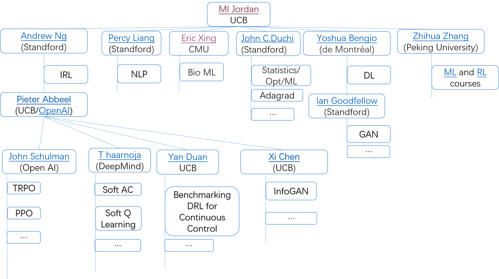

# Bibliography

  > Reinforcement Learning, see for more detail notes on [Reading_Notes](./Reading_Notes.md)

  Contributed by Jingjing Chen, Meng Xu and Ping Guo.

  

  Template

  - **`(optional)abbr`** [title with link](https://arxiv.org/), main author **`(year)`** **`[conference/journal]`**

  A sample

  - **`Pareto MTL`** [Pareto Multi-Task Learning](https://arxiv.org/abs/1912.12854), Xi Lin **`(2019)`** **`[NeurIPS]`**

  

  # Table of contents

  - [Reinforcement Learning](#RL)
  - [Multi-Agent RL](#Multi-Agent-RL)
  - [Multi-Objective RL](#Multi-Objective-RL)

  ## [Reinforcement Learning](#Table-of-contents)

  ### Courses

  - **`Alessandro Lazaric`** [RL_Course](http://researchers.lille.inria.fr/~lazaric/Webpage/MVA-RL_Course14.html)
- [***Lecture 0***: *Introduction to the Course*](http://researchers.lille.inria.fr/~lazaric/Webpage/MVA-RL_Course16_files/slides-course-ext.pdf) ([Notes](http://researchers.lille.inria.fr/~lazaric/Webpage/MVA-RL_Course14_files/notes-course.pdf))
  
- [**Lecture 1**: *Introduction to Reinforcement Learning*](http://researchers.lille.inria.fr/~lazaric/Webpage/MVA-RL_Course14_files/slides-lecture-01-handout.pdf) ([Notes](http://researchers.lille.inria.fr/~lazaric/Webpage/MVA-RL_Course14_files/notes-lecture-01.pdf))
  
- [***Lecture 2***: *Markov Decision Processes and Dynamic Programming*](http://researchers.lille.inria.fr/~lazaric/Webpage/MVA-RL_Course14_files/slides-lecture-02-handout.pdf) ([Notes](http://researchers.lille.inria.fr/~lazaric/Webpage/MVA-RL_Course14_files/notes-lecture-02.pdf))
  
- [***Lecture 3***: *Reinforcement Learning Algorithms*](http://researchers.lille.inria.fr/~lazaric/Webpage/MVA-RL_Course14_files/slides-lecture-03-handout.pdf) ([Notes](http://researchers.lille.inria.fr/~lazaric/Webpage/MVA-RL_Course14_files/notes-lecture-03.pdf))
  
- [***Lecture 4***: *The Multi-arm Bandit Problem*](http://researchers.lille.inria.fr/~lazaric/Webpage/MVA-RL_Course14_files/slides-lecture-04.pdf) ([Notes](http://researchers.lille.inria.fr/~lazaric/Webpage/MVA-RL_Course14_files/notes-lecture-04.pdf))
  
- [***Lecture 5***: *Approximate Dynamic Programming*](http://researchers.lille.inria.fr/~lazaric/Webpage/MVA-RL_Course14_files/slides-lecture-05-handout.pdf) ([Notes](http://researchers.lille.inria.fr/~lazaric/Webpage/MVA-RL_Course14_files/notes-lecture-05.pdf))
  
- [***Lecture 6***: *Sample Complexity of ADP Algorithms*](http://researchers.lille.inria.fr/~lazaric/Webpage/MVA-RL_Course14_files/slides-lecture-06-handout.pdf) 
  
  * [Finite-Sample Analysis of Least-Squares Policy Iteration](http://researchers.lille.inria.fr/~lazaric/Webpage/MVA-RL_Course14_files/lazaric12a.pdf)
    * [Finite-Time Bounds for Fitted Value Iteration](https://jmlr.org/papers/volume9/munos08a/munos08a.pdf)

### Academic family tree

> https://neurotree.org/neurotree/tree.php?pid=236&pnodecount=5&cnodecount=2

### Books

- [Algorithms for Reinforcement Learning](https://sites.ualberta.ca/~szepesva/RLBook.html). **[`Csaba Szepesvári`]**  **[:date:`2010`]**
- [Reinforcement Learning: An Introduction](http://incompleteideas.net/book/the-book.html). **[`Richard S. Sutton et.al`]** **[:date:`2018-2020`]**
- [Reinforcement Learning: Theory and Algorithms](https://rltheorybook.github.io/). **[`Alekh Agarwal et.al`]** **[:date:`2019-2020`]** 

### Articles

### (1) Algorithms

- [(TRPO)Trust Region Policy Optimization](https://arxiv.org/pdf/1502.05477.pdf),  [John Schulman](http://joschu.net/publications.html) ,[Pieter Abbeel](http://people.eecs.berkeley.edu/~pabbeel/) **`2015ICML`**

  > Reading Notes

- [(PPO)Proximal Policy Optimization Algorithms](https://arxiv.org/pdf/1707.06347.pdf)

  > Reading Notes

- [Continuous Control With Deep Reinforcement Learning](https://arxiv.org/pdf/1509.02971.pdf)

- [Soft Actor-Critic: Off-Policy Maximum Entropy Deep Reinforcement Learning with a Stochastic Actor](https://arxiv.org/pdf/1801.01290.pdf)

  > Reading Notes

- 

### (2) Theoretical results

- 
- 

## [Multi Agent Reinforcement Learning](#Table-of-contents)

  ### Survey

  - [A Survey and Critique of Multiagent Deep Reinforcement Learning](https://arxiv.org/abs/1810.05587), Pablo Hernandez-Leal, Bilal Kartal, Matthew E. Taylor **`(2018 Autonomous Agents and Multi-Agent Systems )`**

    >  Earlier versions of this work had the title: "Is multiagent deep reinforcement learning the answer or the question? A brief survey"

* 

  ## Articles

  * [Mean Field Multi-Agent Reinforcement Learning](https://arxiv.org/pdf/1802.05438.pdf),[Wangjun](http://www0.cs.ucl.ac.uk/staff/jun.wang/) **`(2018 ICML)`**

    > Reading Notes

  * [Probabilistic Recursive Reasoning for Multi-Agent Reinforcement Learning](https://arxiv.org/abs/1901.09207), WenYing,[Wangjun](http://www0.cs.ucl.ac.uk/staff/jun.wang/) **`(2019 ICLR)`** 

    >Reading Notes

* [A Regularized Opponent Model with Maximum Entropy Objective](https://arxiv.org/abs/1905.08087), [Zheng Tian](https://arxiv.org/search/cs?searchtype=author&query=Tian%2C+Z),[Ying Wen](https://arxiv.org/search/cs?searchtype=author&query=Wen%2C+Y),[Wangjun](http://www0.cs.ucl.ac.uk/staff/jun.wang/) **`(2019 ICJAI)`**  

  > Reading Notes

  ## [Multi-Objective Reinforcement Learning](#Table-of-contents)

  ### Survey

* [A Survey of Multi-Objective Sequential Decision-Making](https://www.jair.org/index.php/jair/article/view/10836/25862) ,[**D. M. Roijers**](http://roijers.info/pub.html) **`(2013)`**

  - 

  

### Articles

- 